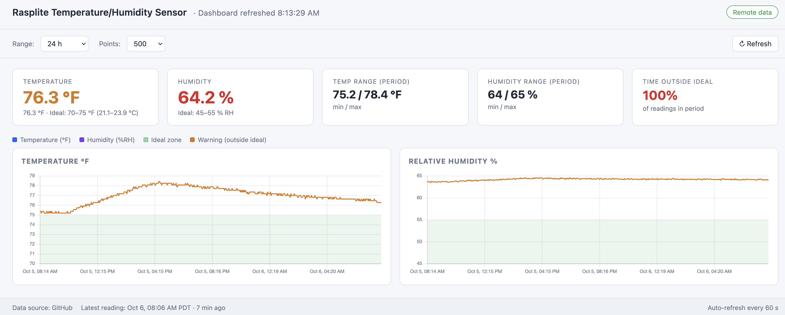

# 🎸 Raspberry Pi Guitar Case Climate Monitor

A lightweight IoT monitoring system and web dashboard for tracking ambient temperature and relative humidity inside an acoustic guitar case. 

This repository acts as the **data container and web front-end** for telemetry captured by a Raspberry Pi deployment running a [DHT22 environmental sensor](https://www.adafruit.com/product/385).



## 🎯 Overview & Ideal Thresholds

Acoustic guitars require stable humidity and temperature to prevent wood warping, bridge lifting, or top cracks. This tool visualizes real-time and historical sensor telemetry against safe environmental thresholds:

* **Ideal Temperature Zone:** $70^\circ\text{F} - 75^\circ\text{F}$ ($21.1^\circ\text{C} - 23.9^\circ\text{C}$)
* **Ideal Relative Humidity Zone:** 45 - 55 RH

The dashboard highlights out-of-range metrics with visual warnings and calculates the percentage of time spent outside ideal conditions over a selected time window.

## ✨ Features

* **Real-time Telemetry Dashboard:** Displays current temperature, relative humidity, period min/max ranges, and total time spent outside ideal safety limits.
* **Interactive Time-Series Plotting:** Dynamic dual-axis charts showing ambient trends across customizable time ranges ($24\text{h}$, $7\text{d}$, etc.) and data point densities.
* **Local Data Storage:** Sensor readings are continuously logged into a lightweight SQLite database stored directly on the Raspberry Pi.
* **Auto-Refresh & Remote Sync:** Automatically refreshes telemetry every 60 seconds with support for remote data source syncing.

## 🛠️ System Architecture & Hardware
```
┌────────────────────────┐      ┌───────────────────────────┐      ┌─────────────────────────────┐
│  DHT22 Sensor          │      │  Raspberry Pi             │      │  Web Front-End              │
│  (Inside Guitar Case)  ├─────►│  • Python logging script  ├─────►│  • HTML / JavaScript        │
│                        │ GPIO │  • SQLite Database        │ Data │  • Interactive Charting     │
└────────────────────────┘      └───────────────────────────┘      └─────────────────────────────┘
```
* **Hardware:** Raspberry Pi 3 + DHT22 (AM2302) Temperature & Humidity Sensor.
* **Backend:** Python GPIO polling service logging to a local SQLite database on the Pi.
* **Front-end:** Lightweight HTML, CSS, and JavaScript interface displaying live metrics and chart visualizations.

## 🚀 Quickstart & Setup

### 1. Hardware Assembly
Connect the DHT22 sensor to the Raspberry Pi GPIO pins:
* **VCC:** Pin 1 (3.3V) or Pin 2 (5V)
* **DATA:** GPIO Pin 4 (Pin 7)
* **GND:** Pin 6 (Ground)
